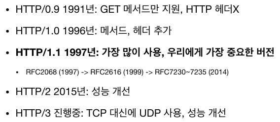

# HTTP 기본

### 모든 것이 HTTP

**HTTP 메시지에 모든 것을 전송**

- HTML, TEXT, Image, 음성, 영상, 파일
- JSON, XML (API)
- 거의 모든 형태의 데이터 전송 가능
- 서버 간 데이터를 주고 받을 때도 대부분 HTTP 사용

**HTTP 역사**

**기반 프로토콜**

- TCP: HTTP/1.1, HTTP/2
- UDP: HTTP/3
- 현재는 HTTP/1.1을 주로 사용
    - HTTP/2, HTTP/3도 점점 증가

**HTTP 특징**

- 클라이언트-서버 구조
    - Request-Response 구조
    - 클라이언트 서버에 요청을 보내고 응답 대기
    - 서버가 요청에 대한 결과를 만들어서 응답
    
    
    
    - 클라이언트와 서버를 분리하는 것이 중요
        - 클라이언트는 UI에, 서버는 비즈니스 로직에 집중
- 무상태(stateless) 프로토콜, 비연결성
- HTTP 메시지
- 단순함, 확장 가능

### 무상태 프로토콜

**Stateless**

- 서버가 클라이언트 상태를 보존하지 않음
- 장점: 서버 확장성 높음 (스케일-아웃)
- 단점: 클라이언트 추가 데이터 전송

**Stateful, Stateless 차이**

- Stateful
    
    
    
    - 점원이 고객의 상태를 알고 있음

- Stateless
    
    
    
    - 고객이 질문 상태를 구체적으로 제시

**위 예시에서 점원이 중간에 바뀌면?**

- 상태 유지에선 점원이 바뀌면 문맥(context)이 사라짐
- 무상태에선 점원이 바뀌어도 그대로 동작

**정리**

- 상태 유지
    - 중간에 다른 점원으로 바뀌면 안 됨
        - 상태 정보를 다른 점원에게 미리 알려줘야 동작
- 무상태
    - 중간에 다른 점원으로 바뀌어도 됨
        - 갑자기 고객이 증가해도 점원 대거 투입 가능
        - 갑자기 클라이언트 요청이 증가해도 서버를 대거 투입할 수 있음
    - 무상태는 응답 서버를 쉽게 바꿀 수 있음 → 무한한 서버 증설 가능

**상태 유지 - Stateful**

**무상태 - Stateless**

**실무 한계**

- 모든 것을 무상태로 설계할 수 있는 경우도 있고 없는 경우도 있음
    - 무상태
        - 로그인이 필요 없는 단순 서비스 소개 화면
    - 상태 유지가 필요한 경우
        - 로그인한 사용자의 경우 로그인 했다는 상태를 서버에 유지
        - 일반적으로 브라우저 쿠키와 서버 세션 등 사용
        - 상태 유지는 최소한만 사용

### 비연결성 (connectionless)

- 클라이언트들이 서버에 모두 연결되어 있으면, 불필요한 서버 자원이 소모됨

- 서버가 요청 응답이 끝나면 연결을 해제해서 자원을 소모하지 않음

**비연결성**

- HTTP는 기본이 연결을 유지하지 않는 모델
- 일반적으로 초 단위 이하의 빠른 속도로 응답
- 1시간 동안 수천명이 서비스를 사용해도 실제 서버에서 동시 처리하는 요청은 수십개 이하로 매우 적음
    - ex) 웹 브라우저에서 계속 연속해서 검색 버튼을 누르지 않아도 검색이 됨
- 서버 자원을 매우 효율적으로 사용할 수 있음

**한계와 극복**

- TCP/IP 연결을 새로 맺어야 함
    - 3 way handshake 시간 추가
- 웹 브라우저로 사이트를 요청하면 HTML 뿐만 아니라 JS, css, 추가 이미지 등 수많은 자원이 함께 다운로드
- 지금은 HTTP 지속 연결(Persistent Connections)로 문제 해결

**HTTP 초기 - 연결, 종료 낭비**

**HTTP 지속 연결 (Persistent Connections)**

- 그렇다면 Persistent Connections는 비연결성을 지키지 않는 것인가?
    - 연결을 계속 유지하는 것 같아 보이지만, 실제로는 아님
    - HTTP 요청은 여전히 독립적으로 처리하고, TCP 연결만 유지하는 상태

### HTTP 메시지

**HTTP 메시지 구조**

**시작 라인 - 요청 메시지**

- start-line = request-line
- request-line = method SP(공백) request-target SP HTTP -version CRLF(엔터)

**HTTP 메서드**

- GET, POST, PUT, DELETE, …
- 서버가 수행해야 할 동작 지정

**요청 대상**

- absolute-path[?query] (절대경로[?쿼리])
- 절대 경로=”/”로 시작하는 경로

**시작 라인  - 응답 메시지**

- start-line = status-line
- status-line = HTTP-version SP status-code SP reason-phrase CRLF
- HTTP 상태 코드: 요청 성공, 실패를 나타냄

**HTTP 헤더**

- header-field = field-name ":" OWS field-value OWS      (OWS:띄어쓰기 허용)
- field-name은 대소문자 구문 없음

**HTTP 헤더 - 용도**

- HTTP 전송에 필요한 모든 부가정보
    - 메세지 바디 내용
    - 메시지 바디 크기, 압축
    - 인증
    - 요청 클라이언트(브라우저) 정보
    - 서버 어플리케이션 정보
    - 캐시 관리 정보, …
- 표준 헤더가 너무 많음
- 필요 시 임의의 헤더 추가 가능

**HTTP 메시지 바디 - 용도**

- 실제 전송할 데이터
- HTML, 이미지, 영상, JSON 등 byte로 표현할 수 있는 모든 데이터