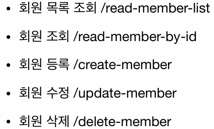

# HTTP 메서드

### HTTP API를 만들어보자

**요구사항**

- 회원 정보 관리 API를 만들어라
    - 회원 목록 조회, 회원 조회/등록/수정/삭제

**API URI 설계**

**이것은 좋은 URI 설계일까?**

- 가장 중요한 것은 **리소스 식별**

**API URI 고민**

- 리소스의 의미는 뭘까?
    - 회원을 등록/수정/조회는 리소스가 아님
    - 회원이라는 개념 자체가 바로 리소스
- 리소스는 어떻게 식별하는 게 좋을까?
    - 회원을 등록하고 수정하고 조회하는 것을 모두 배제
    - 회원이라는 리소스만 식별하면 됨
        - 회원 리소스를 URI에 매핑

**리소스 식별, URI 계층 구조 활용**

- 참고로 계층 구조상 상위를 컬렉션으로 보고 복수 단어를 사용 권장 (member → members)
- 조회/등록/수정/삭제는 URI가 다 같은데, 어떻게 구분하지?

**리소스와 행위를 분리**

- 가장 중요한 것은 리소스 식별
    - URI는 리소스만 식별
- 리소스와 해당 리소스를 대상으로 하는 행위를 분리
    - 리소스: 회원
    - 행위: 조회, 등록, 삭제, 변경
- 리소스는 명사, 행위는 동사
- 행위(메서드)는 어떻게 구분?

### HTTP 메서드 - GET, POST

**주요 메서드**

- GET: 리소스 조회
- POST: 요청 데이터 처리, 주로 등록에 사용
- PUT: 리소스 대체, 해당 리소스가 없으면 생성
- PATCH: 리소스 부분 변경
- DELETE: 리소스 삭제

**기타 메서드**

- HEAD: GET과 동일하나 메시지 부분을 제외하고, 상태 줄과 헤더만 반환
- OPTIONS: 대상 리소스에 대한 통신 가능 옵션(메서드)을 설명
    - 주로 CORS에서 사용
- CONNECT: 대상 리소스로 식별되는 서버에 대한 터널을 설정
- TRACE: 대상 리소스에 대한 경로를 따라 메시지 루프백 테스트 수행

**GET**

- 리소스 조회
- 서버에 전달하고 싶은 데이터는 query(쿼리 파라미터)를 통해 전달
- 메시지 바디를 사용해서 데이터를 전달할 수는 있지만, 권장하지 않음

**POST**

- 요청 데이터 처리
- 메시지 바디를 통해 서버로 요청 데이터 전달
- 서버는 요청 데이터 처리
    - 메시지 바디를 통해 들어온 데이터를 처리하는 모든 기능 수행
- 주로 전달된 데이터로 신규 리소스 등록, 프로세스 처리에 사용

**POST - 요청 데이터를 어떻게 처리한다는 뜻일까?**

- HTML 양식에 입력된 필드와 같은 데이터 블록을 데이터 처리 프로세스에 제공
    - HTML FORM에 입력한 정보로 회원 가입, 주문 등
- 게시판, 뉴스 그룹, 메일링 리스트, 블로그 또는 유사한 기사 그룹에 메시지 게시
    - 게시판 글쓰기, 댓글 달기
- 서버가 아직 식별하지 않은 새 리소스 생성
    - 신규 주문 생성

→ 이 리소스 URI에 포스트 요청이 오면 요청 데이터를 어떻게 처리할 지 리소스마다 따로 정해야 함

**POST - 정리**

- 단순히 데이터를 생성하거나 변경하는 것을 넘어서 프로세스를 처리해야 하는 경우
    - 주문에서 결제 완료 → 배달 시작 → 배달 완료처럼 단순히 값 변경을 넘어 프로세스 상태가 변경되는 경우
- POST 결과로 새로운 리소스가 생성되지 않을 수도 있음
    - POST /orders/{orderId}/start-delivery (컨트롤 URI)
- 다른 메서드로 처리하기 애매한 경우
    - JSON으로 조회 데이터를 넘겨야 하는데, GET 메서드를 사용하기 어려운 경우
    - 애매하면 POST 사용

### HTTP 메서드 - PUT, PATCH, DELETE

**PUT**

- 리소스를 대체
    - 리소스가 있으면 대체, 없으면 생성
    - 쉽게 이야기해서 덮어버림
- **클라이언트가 리소스를 식별**
    - 클라이언트가 리소스 위치를 알고 URI 지정
    - POST와 다른 점
        - POST에선 `/members`로 요청을 보내면 신규 생성
        - PUT은 `/members/100` 처럼 리소스 위치를 알고 있음

 **PUT - 리소스가 있는 경우**

**PUT - 리소스가 없는 경우**

- 없는 데이터에 대해선 새롭게 생성

**PUT - 리소스를 완전히 대체**

- 기존 리소스(username)를 삭제하고 새로 들어온 리소스만 들어와있음
- 이런 의도로 사용하려면 PATCH를 사용

**PATCH**

- 리소스 부분 변경

**DELETE** 

- 리소스 제거

### HTTP 메서드 속성

**안전 (Safe)**

- 호출해도 리소스를 변경하지 않는다
    - GET은 안전함, 그 외 나머지는 안전하지 않음

**멱등 (Idempotent)**

- $f(f(x)) = f(x)$
- 한 번 호출하든, 두 번 호출하든, 100번 호출하든 그 결과가 똑같음
- 멱등 메서드
    - GET: 한 번 조회하든, 두 번 조회하든 같은 결과가 조회
    - PUT: 결과를 대체하므로, 같은 요청을 여러 번 해도 최종 결과는 같음
    - DELETE: 결과를 삭제하므로 여러 번 요청해도 삭제된 결과는 같음
- 멱등이 아닌 메서드
    - POST: 두 번 호출하면 같은 결제가 중복해서 발생 가능

**멱등 활용**

- 자동 복구 매커니즘
- “서버가 TIMEOUT 등으로 정상 응답을 못 주었을 때, 
 클라이언트가 같은 요청을 다시 해도 되는가?” 의 판단 근거
- 멱등은 외부 요인으로 중간에 리소스가 변경되는 것 까지는 고려하지 않음
    
    
    
    - 이 경우 1번 GET과 2번 GET 요청의 결과는 다르지만, 멱등은 이를 고려하진 않는다

**캐시 가능 (Cacheable)**

- 응답 결과 리소스를 캐시해서 사용해도 되는가?
- GET, HEAD, POST, PATCH - 캐시 가능
    - 실제로는 GET, HEAD 정도만 캐시로 사용
- POST, PATCH는 본문 내용까지 캐시 키로 고려해야 하는데, 구현이 쉽지 않음