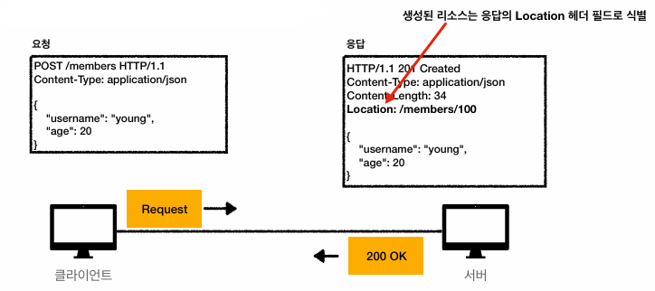

# HTTP 상태 코드

### HTTP 상태 코드

**상태 코드**

- 클라이언트가 보낸 요청의 처리 상태를 응답에서 알려주는 기능
    - 1xx (Informational): 요청이 수신되어 처리중
    - 2xx (Successful): 요청 정상 처리
    - 3xx (Redirection): 요청을 완료하려면 추가 행동이 필요
    - 4xx (Client Error): 클라이언트 오류, 잘못된 문법 등으로 서버가 요청 수행 불가
    - 5xx (Server Error): 서버 오류, 서버가 정상 요청을 처리하지 못함

**만약 모르는 상태 코드가 나타나면?**

- 클라이언트가 인식할 수 없는 상태 코드를 서버가 반환하면?
    - 클라이언트는 상위 상태 코드로 해석해서 처리
- 미래에 새로운 상태 코드가 추가되어도 클라이언트를 변경하지 않아도 됨
- 예시
    - 299 ??? → 2xx (Successful)
    - 451 ??? → 4xx (Client Error)

### 2xx - 성공

**클라이언트 요청을 성공적으로 처리**

- 200 OK
    - 요청 성공
- 201 Created
    - 요청 성공해서 새로운 리소스가 생성됨
    
    
    
- 202 Accepted
    - 요청이 접수되었으나 처리가 완료되지 않았음
        - 배치 처리 같은 곳에 사용
        - ex) 요청 접수 후 1시간 뒤에 배치 프로세스가 요청 처리
- 204 No Content
    - 서버가 요청을 성공적으로 수행했지만, 응답 페이로드 본문에 보낼 데이터가 없음
    - ex) 웹 문서 편집기의 save 버튼
        - save 버튼의 결과로 아무 내용이 없어도 됨
        - 버튼을 눌러도 같은 화면만 유지해야 함
        - 결과 내용이 없어도 204 메시지만으로 성공을 인식할 수 있음

### 3xx - 리다이렉션

**요청을 완료하기 위해 유저 에이전트 추가 조치 필요**

- 300 Multiple Choices
- 301 Moved Permanently
- 302 Found
- 303 See Other
- 304 Not Modified
- 307 Temporary Redirect
- 308 Permanent Redirect

**리다이렉션 이해**

- 웹 브라우저는 3xx 응답 결과에 Location 헤더가 있으면, Location 위치로 자동 이동 (리다이렉트)

**자동 리다이렉트 흐름**

- 이벤트 페이지가 /event에서 /new-event로 바뀌었다고 할 때,
    - 유저가 /event로 접속하면 서버에선 301 상태 코드와 함께 헤더에 Location: /new-event를 포함시켜 응답
    - /new-event 경로로 다시 이동
- 웹 브라우저는 /new-event에 다시 요청을 보냄

**리다이렉션 종류**

- 영구 리다이렉션
    - 특정 리소스의 URI가 영구적으로 이동
        - /members → /users
        - /event → /new-event
- 일시 리다이렉션
    - 일시적인 변경
        - 주문 완료 후 주문 내역 화면으로 이동
    - PRG: Post/Redirect/Get
- 특수 리다이렉션
    - 결과 대신 캐시 사용

**영구 리다이렉션**

- 리소스의 URI가 영구적으로 이동
- 원래의 URL을 사용하지 않고 검색 엔진 등에서도 변경 인지
- 301 Moved Permanently
    - 리다이렉트 시 요청 메서드가 GET으로 변하고, 본문이 제거될 수 있음(MAY)
- 308 Permanent Redirect
    - 301과 기능은 같음
    - 리다이렉트 시 요청 메서드와 본문 유지 (처음 POST를 보내면 리다이렉트도 POST 유지)

**영구 리다이렉션 - 301**

- 301 Redirect 요청 시 POST 요청이 GET 요청으로 바뀜
- name=hello&age=20 메시지가 제거됨
- new-event 페이지가 나타나고 끝

**영구 리다이렉션 - 308**

- POST 요청을 그대로 유지
- name=hello&age=20 메시지도 유지
- 실무에서는 대부분 301을 사용하는 것이 맞음

### **일시적인 리다이렉션**

**302, 307, 303**

- 리소스의 URI가 일시적으로 변경
    - 따라서 검색 엔진 등에서 URL을 변경하면 안 됨
- 302 Found
    - 리다이렉트 시 요청 메서드가 GET으로 변하고, 본문이 제거될 수 있음(MAY)
- 307 Temporary Redirect
    - 302와 기능은 같음
    - 리다이렉트 시 요청 메서드와 본문 유지(요청 메서드를 변경하면 안 됨, MUST NOT)
- 303 See Other
    - 302와 기능은 같음
    - 리다이렉트 시 요청 메서드가 GET으로 변경(명확하게 GET으로 변경)

**PRG: POST/Redirect/GET**

- POST로 주문 후에 웹 브라우저를 새로고침하면?
    - 새로고침은 다시 요청 → 중복 주문이 될 수 있음

- 주문 완료 후 새로고침 버튼을 누르니, 중복 주문이 되어 주문 데이터 2개가 DB에 저장됨

- POST로 주문 후에 주문 결과 화면을 GET 메서드로 리다이렉트
    - 응답을 200 OK가 아닌 302 FOUND로 반환 (또는 303 SEE OTHER)
        - 헤더의 Location에 주문 결과 리소스를 포함
- 새로고침해도 결과 화면을 GET으로 조회
- 중복 주문 대신에 결과 화면만 GET으로 다시 요청

**302, 307, 303 - 그래서 뭘 써야 할까?**

- 잠깐 정리
    - 302 FOUND → GET으로 변할 수 있음
    - 307 Temporary Redirect → 메서드가 변하면 안 됨
    - 303 See Other → 메서드가 GET으로 변경
- 역사
    - 처음 302 스펙의 의도는 HTTP 메서드 유지
        - 그러나 웹 브라우저들이 대부분 GET으로 바꿔버림
        - 그래서 모호한 302를 대신하는 명확한 307, 303 등장 (301 대응으로 308도 등장)
- 현실
    - 307, 303을 권장하나 현실적으로 이미 많은 어플리케이션 라이브러리들이 302를 기본값으로 사용
    - 자동 리다이렉션 시 GET으로 변해도 되면 그냥 302 사용

**기타 리다이렉션**

- 300 Multiple Choices: 사용하지 않음
- 304 Not Modified
    - 캐시를 목적으로 사용
    - 클라이언트에게 리소스가 수정되지 않았음을 알려줌
        - 따라서 클라이언트는 로컬 PC에 저장된 캐시를 재사용 (캐시로 리다이렉트)
    - 304 응답은 응답에 메시지 바디를 포함하면 안 됨 (로컬 캐시를 사용해야 하므로)
    - 조건부 GET, HEAD 요청 시 사용

### 4xx - 클라이언트 오류, 5xx - 서버 오류

**4xx (Client Error)**

- 오류 원인이 클라이언트에 있음
- 클라이언트가 이미 잘못된 요청, 데이터를 보내고 있기 때문에 똑같은 재시도가 실패
    - 5xx 에러는 서버가 복구되거나 했을 때 재시도가 성공할 수도 있음

**400 Bad Request**

- 클라이언트가 잘못된 요청을 해서 서버가 요청을 처리할 수 없음
    - 요청 구문, 메시지 등 오류
    - 클라이언트는 요청 내용을 재검토하고 보내야 함
        - ex) 요청 파라미터가 잘못되거나, API 스펙이 맞지 않을 때

**401 Unauthorized**

- 클라이언트가 해당 리소스에 대한 인증이 필요함
    - 인증(Authentication) 되지 않음
    - 401 오류 발생 시 응답에 WWW-Authenticate 헤더와 함께 인증 방법을 설명
    - 참고
        - 인증(Authentication): 본인이 누구인지 확인 (로그인)
        - 인가(Authorization): 권한부여 (ADMIN 권한처럼 특정 리소스에 접근할 수 있는 권한,
        인증이 있어야 인가가 있음)
        - 오류 메시지가 Unauthorized지만 인증되지 않음 (Unauthenticated가 맞지 않을까?)

**403 Forbidden**

- 서버가 요청을 이해했지만 승인을 거부함
    - 주로 인증 자격 증명은 있지만, 접근 권한이 불충분한 경우
    - ex) 어드민 등급이 아닌 사용자가 로그인은 했지만, 어드민 등급의 리소스에 접근하는 경우

**404 Not Found**

- 요청 리소스를 찾을 수 없음
    - 요청 리소스가 서버에 없음
    - 또는 클라이언트가 권한이 부족한 리소스에 접근할 때 해당 리소스를 숨기고 싶을 때

**5xx (Server Error)**

- 서버 오류
    - 서버에 문제가 있기 때문에 재시도하면 성공할 수도 있음

**500 Internal Server Error**

- 서버 문제로 오류 발생, 애매하면 500 오류
    - 서버 내부 문제로 오류 발생
    - 애매하면 500 오류

**503 Service Unavailable**

- 서비스 이용 불가
    - 서버가 일시적인 과부하 또는 예정된 작업으로 잠시 요청을 처리할 수 없음
    - Retry-After 헤더 필드로 얼마 뒤에 복구되는지 보낼 수도 있음