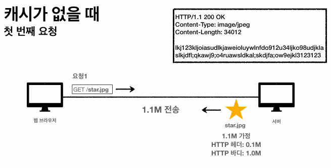

# HTTP 헤더 - 캐시와 조건부 요청

### 캐시 기본 동작

- 총 1.1M가 전송됨

- 1.1M가 또 전송됨
- 데이터가 변경되지 않아도 계속 네트워크를 통해 데이터를 다운로드 받아야 함
- 인터넷 네트워크는 매우 느리고 비쌈
- 브라우저 로딩 속도가 느림

→ 느린 사용자 경험

- 요청을 처리하고 60초 동안 캐시에 결과를 저장

- 캐시 적용 후 캐시 가능 시간 동안 네트워크를 사용하지 않아도 됨
- 비싼 네트워크 사용량을 줄임
- 브라우저 로딩 속도가 매우 빠름

→ 빠른 사용자 경험

- 캐시 유효 시간이 초과하면 서버를 통해 데이터를 다시 조회하고 캐시 갱신
- 이 때 다시 네트워크 다운로드가 발생

### 검증 헤더와 조건부 요청 1

**캐시 시간 초과**

- 캐시 유효 시간이 초과해서 서버에 다시 요청하면 두 가지 상황이 나타남
    
    
    

**서버에서 기존 데이터를 변경하지 않음**

- 생각해보면 데이터를 전송하는 대신 저장해두었던 캐시를 재사용할 수 있음
- 단, 클라이언트 데이터와 서버 데이터가 같다는 사실을 확인할 수 있는 방법이 필요함
    - 검증 헤더 사용

- Last-Modifed 헤더 추가
    - 마지막 수정일을 추가

- 캐시에 최종 수정일 정보 저장

- 캐시에 Last-Modified 헤더가 존재하면, 웹 브라우저가 서버에 요청을 보낼 때 헤더에
if-modified-since: 2020년 11월 10일 10:00:00를 추가

- 서버에서 날짜를 보고 판단
    - 수정이 안 됐으면 재사용

- 수정된 게 없으므로 HTTP 바디를 빼버림
- 실제 전송되는 것은 Body가 없는 HTTP 헤더 0.1M

- cache-control 값을 갱신하고 캐시를 다시 세팅함

- 브라우저에서 다시 세팅된 캐시를 사용

**정리**

- 캐시 유효 시간이 초과해도, 서버 데이터가 갱신되지 않으면
    - 304 Not Modified + 헤더 메타 정보만 응답 (바디 X)
    - 클라이언트는 서버가 보낸 응답 헤더 정보로 캐시의 메타 정보를 갱신
        - 예시에선 cache-control: max-age 정보 갱신
    - 클라이언트는 캐시에 저장되어 있는 데이터 재활용
- 결과적으로 네트워크 다운로드가 발생하지만 용량이 적은 헤더 정보만 다운로드
- 매우 실용적인 해결책

### 검증 헤더와 조건부 요청 2

**검증 헤더와 조건부 요청**

- 검증 헤더
    - 캐시 데이터와 서버 데이터가 같은지 검증하는 데이터
    - Last-Modified, ETag
- 조건부 요청 헤더
    - 검증 헤더로 조건에 따른 분기
    - If-Modified-Since: Last-Modified 사용
    - If-None-Match: ETag 사용
    - 조건이 만족하면 200 OK, 조건이 만족하지 않으면 304 Not Modified

**예시**

- If-Modified-Since: 이후에 데이터가 수정되었으면?
- 데이터 미변경 예시
    - 캐시: 2020년 11월 10일 10:00:00 vs 서버: 2020년 11월 10일 10:00:00
    - 304 Not Modified, 헤더 데이터만 전송 (BODY 미포함)
        - 캐시로 리다이렉션
    - 전송 용량 0.1M (헤더 용량)
- 데이터 변경 예시
    - 캐시: 2020년 11월 10일 10:00:00 vs 서버: 2020년 11월 10일 11:00:00
    - 200 OK, 모든 데이터 전송 (BODY 포함)
    - 전송 용량 1.1M (헤더 0.1M, 바디 1.0M)

**Last-Modified, If-Modified-Since 단점**

- 1초 미만 단위로 캐시 조정 불가능
- 날짜 기반의 로직 사용
- 데이터를 수정해서 날짜가 다르지만, 같은 데이터를 수정해서 데이터 결과가 똑같은 경우
    - A → B → A, 결국 데이터는 A
- 서버에서 별도의 캐시 로직을 관리하고 싶은 경우
    - 스페이스나 주석처럼 크게 영향이 없는 변경에서 캐시를 유지하고 싶은 경우

**ETag, If-None-Match**

- ETag(Entity Tag)
    - 캐시용 데이터에 임의의 고유한 버전 이름을 달아둠
        - ex) ETag: "v1.0", ETag: "a2jiodwjekjl3”
    - 데이터가 변경되면 이 이름을 바꾸어서 변경 (Hash를 다시 생성)
        - 파일 컨텐츠가 똑같으면 똑같은 Hash 결과를 가짐
- 단순하게 ETag만 보내서 같으면 유지, 다르면 다시 받기

- 캐시에 ETag 값 저장

- 두 값이 일치하므로 실패, 304 Not Modified

- 캐시 헤더 데이터를 갱신해 캐시 세팅
- 이후 브라우저에서 해당 캐시 조회
    
    
    

**ETag, If-None-Match 정리**

- 단순하게 ETag만 서버에 보내서 같으면 유지, 다르면 다시 받기
- 캐시 제어 로직을 서버에서 완전히 관리
- 클라이언트는 단순히 이 값을 서버에 제공 (클라이언트는 캐시 매커니즘을 모름)
- 예시
    - 서버는 배타 오픈 기간인 3일 동안 파일이 변경되어도 ETag를 동일하게 유지
    - 어플리케이션 배포 주기에 맞춰 ETag 모두 갱신

### 캐시와 조건부 요청 헤더

**캐시 제어 헤더**

- Cache-Control: 캐시 제어
- Pragma: 캐시 제어(하위 호환)
- Expires: 캐시 유효 기간(하위 호환)

**Cache-Control 캐시 지시어(directives)**

- Cache-Control: max-age
    - 캐시 유효 시간, 초 단위
- Cache-Control: no-cache
    - 데이터는 캐시해도 되지만, 항상 origin 서버에 검증하고 사용
        - 데이터가 바뀌었는지 안 바뀌었는지 검증
- Cache-Control: no-store
    - 데이터에 민감한 정보가 있으므로 저장하면 안 됨 (메모리에서 사용하고 최대한 빨리 삭제)

**Pragma**

- 캐시 제어(하위 호환)
- Pragma: no-cache
- HTTP 1.0 하위 호환, 거의 사용 안 함

**Expires**

- 캐시 만료일 지정(하위 호환)
    - expires: Mon, 01 Jan 1990 00:00:00 GMT
- 캐시 만료일을 정확한 날짜로 지정
- 지금은 더 유연한 Cache-Control: max-age 권장

### 프록시 캐시

**원(origin) 서버 직접 접근**

**프록시 캐시 도입**

- 요청이 오면 미국 원 서버에 직접 접근하는 것이 아닌, 프록시 캐시 서버에 접근하도록 만듦

- 내 웹 브라우저나 로컬에 저장하는 캐시를 private 캐시라 함
- 중간에서 공용으로 사용하는 캐시를 public 캐시라 함

**Cache-Control 캐시 지시어 - 기타**

- Cache-Control: public
    - 응답이 public 캐시에 저장되어도 됨
- Cache-Control: private
    - 응답이 해당 사용자만을 위한 것임
    - private 캐시에 저장해야 함 (default)
- Cache-Control: s-maxage
    - 프록시 캐시에만 적용되는 max-age
- Age: 60 (HTTP 헤더)
    - 원 서버에서 응답 후 프록시 캐시 내에 머문 시간(초)

### 캐시 무효화

**캐시 지시어 - 확실한 캐시 무효화 응답**

- Cache-Control: no-cache
    - 데이터는 캐시해도 되지만, 항상 원 서버에 검증하고 사용
- Cache-Control: no-store
    - 데이터에 민감한 정보가 있으므로 저장하면 안 됨
    - 메모리에서 사용하고 최대한 빨리 삭제
- Cache-Control: must-revalidate
    - 캐시 만료 후 최초 조회 시 원 서버에서 검증해야 함
    - 원 서버 접근 실패 시 반드시 오류가 발생해야 함 (504 Gateway Timeout)
    - must-revalidate는 캐시 유효 시간이라면 캐시를 사용
- Pragma: no-cache
    - HTTP 1.0 하위 호환

**no-cache vs must-revalidate**

- no-cache이므로 프록시 캐시가 아닌 원 서버에서 검증해야 함

- 원 서버가 접근이 불가할 때, 오래된 데이터라도 보여주자
- 200 OK를 응답으로 반환

- 중요한 데이터는 오래된 데이터든 뭐든 그냥 안 보여주는 것이 맞음
- must-revalidate는 504 Gateway Timeout을 응답으로 반환